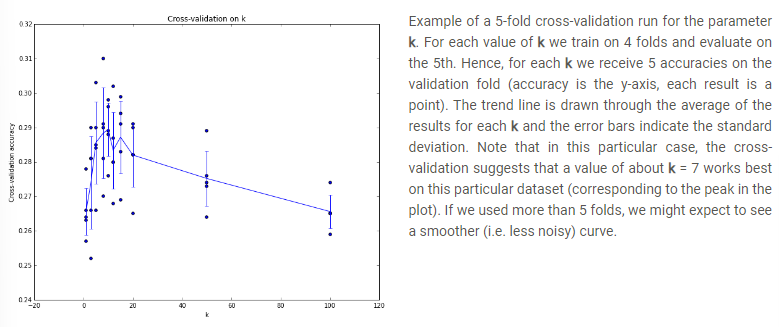
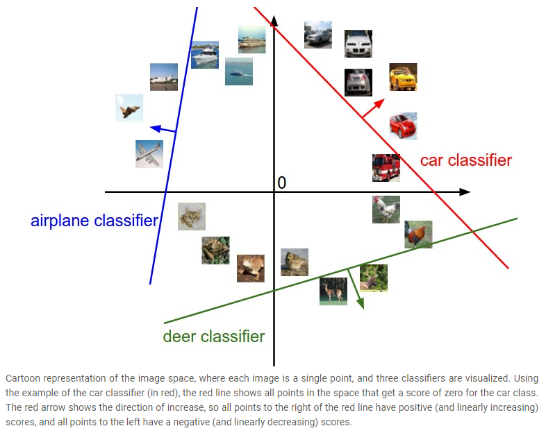
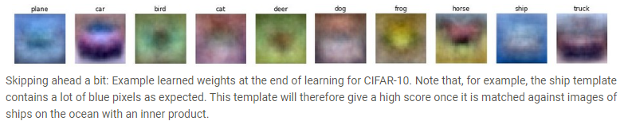

# Lecture 2: Data-driven approach, kNN, Linear Classification 1
These notes are based primarily on the YouTube video [CS231n Winter 2016: Lecture 2: Data-driven approach, kNN, Linear Classification 1][youtube]. I also  supplemented this information using the official course notes on [image classification][cs231n-l2-1] and [linear classification][cs231n-l2-2].

## Nearest Neighbor Classifier
- To solve image classification problems, instead of writing a custom algorithm, we use a *data-driven* approach.
- Should be robust to things like camera angle, deformation, illumination, occlusion, etc.
- pipeline: *input* (*N* images each labelled with *K* different classes referred to as the *training set*), *learning* (i.e. *training the classifier*), and *evaluation* (predict labels for a new set of images that it has never seen before).
- [CIFAR-10][CIFAR-10] is a *Nearest Neighbor Classifier* (rarely used in practice).
- *L1 (Manhattan) distance*: compare two images pixel by pixel ($P$ below) then sum over all pixels:

$$d_1(I_1, I_2) = \sum_{P}\lvert I_1^P - I_2^P\rvert$$


- See code below as example of using L1 distance to implement a classifier:

```python
import numpy as np

class NearestNeighbor(object):
  def __init__(self):
    pass

  def train(self, X, y):
    """ X is N x D where each row is an example. Y is 1-dimension of size N """
    # the nearest neighbor classifier simply remembers all the training data
    self.Xtr = X
    self.ytr = y

  def predict(self, X):
    """ X is N x D where each row is an example we wish to predict label for """
    num_test = X.shape[0]
    # lets make sure that the output type matches the input type
    Ypred = np.zeros(num_test, dtype = self.ytr.dtype)

    # loop over all test rows
    for i in range(num_test):
      # find the nearest training image to the i'th test image
      # using the L1 distance (sum of absolute value differences)
      distances = np.sum(np.abs(self.Xtr - X[i,:]), axis = 1)
      min_index = np.argmin(distances) # get the index with smallest distance
      Ypred[i] = self.ytr[min_index] # predict the label of the nearest example

    return Ypred

Xtr, Ytr, Xte, Yte = load_CIFAR10('data/cifar10/') # a magic function we provide
# flatten out all images to be one-dimensional
Xtr_rows = Xtr.reshape(Xtr.shape[0], 32 * 32 * 3) # Xtr_rows becomes 50000 x 3072
Xte_rows = Xte.reshape(Xte.shape[0], 32 * 32 * 3) # Xte_rows becomes 10000 x 3072

nn = NearestNeighbor() # create a Nearest Neighbor classifier class
nn.train(Xtr_rows, Ytr) # train the classifier on the training images and labels
Yte_predict = nn.predict(Xte_rows) # predict labels on the test images
# and now print the classification accuracy, which is the average number
# of examples that are correctly predicted (i.e. label matches)
print 'accuracy: %f' % ( np.mean(Yte_predict == Yte) )
```

- The above example is not very accurate (38%).
- *L2 (Euclidean) distance*: computes the pixel-wise difference as before, but this time we square all of them, add them up and finally take the square root.
$$d_2(I_1, I_2) = \sqrt{\sum_{P}(I_1^P - I_2^P)^2}$$
- Can change `distance` computation in `NearestNeighbor` class with the following :

```python
# using the L2 distance
distances = np.sqrt(np.sum(np.square(self.Xtr - X[i,:]), axis = 1))
```

- note we can leave out the square-root because it is a monotonic function.
- The speed for both examples is `O(t)`.
- These examples require low computational effort (constant) at train time, and high at test. ConvNets are the opposite.

## k - Nearest Neighbor Classifier
- Retrieves K several nearest examples instead of just one (as was the case above) then "vote" on the label of the test image.
- When `k = 1`, we recover the Nearest Neighbor classifier.
- Higher values of k have a smoothing effect that makes the classifier more resistant to outliers.
- `k` is a hyperparameter.
- k - Nearest Neighbor Classifiers are not used in practice.


## Validation sets for Hyperparameter tuning
- One cannot use the test set for the purpose of tweaking hyperparameters.
- Test data is a proxy for measuring the *generalization* of the classifier.
- Note: should think of the test set as a very precious resource that should ideally never be touched until one time at the very end (performance results on test set used in report).
- Use a *validation set for this instead to tune the hyperparameters.
- *Cross-validation*: cycle through the choice of which "fold" is the validation fold then average the results.



## Linear Classification
- Will use a *score function* to map raw data to class scores and a *loss function* that quantifies the agreement between the predicted scores and the ground truth labels.
- *Linear CLassifier*: The simplest function is a linear mapping:

$$f(\mathbf{x_i},W,\mathbf{b}) = W\mathbf{x_i} + \mathbf{b}$$

- $\mathbf{x_i}$ has all of its pixels flattened out to a single column vector of shape [D x 1].
- The matrix $W$ has size [K x D].
- The vector $\mathbf{b}$ has size [K x 1].
- $W$ and $\mathbf{b}$ are the parameters of the function $f$.


- Linear classifier computes a weighted sum of all pixel values.
- It has the capacity to "like" or "dislike" certain positions.
- THe image $\mathbf{x_i}$ can be viewed as a point in a high-dimensional space.
- The classifier can be interpreted as selecting a $W$ that translates the points to form groupings based on the classes.



- The classifier can also be interpreted as a template matcher.



## Loss Functions
- Quantifies what is considered good/bad in classifier performance (what is a good $W$).

[youtube]:https://youtu.be/8inugqHkfvE?si=rl3WuX3NM242dZG7
[cs231n-l2-1]:https://cs231n.github.io/classification/
[cs231n-l2-2]:https://cs231n.github.io/linear-classify/
[CIFAR-10]:https://www.cs.toronto.edu/~kriz/cifar.html