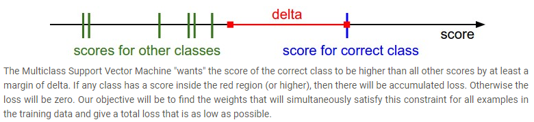
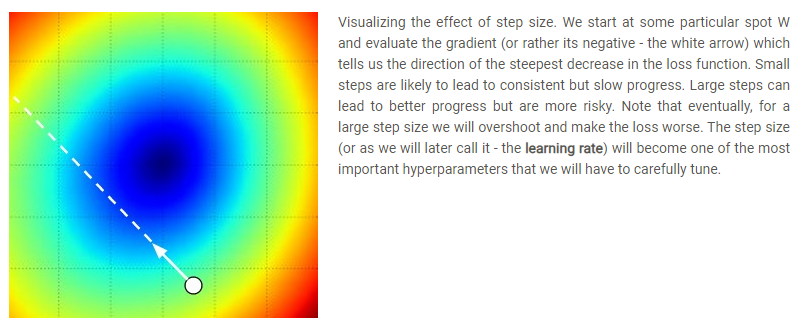

# Lecture 3: Linear Classification 2, Optimization
These notes are based primarily on the YouTube video [CS231n Winter 2016: Lecture 3: Linear Classification 2, Optimization][youtube]. I also  supplemented this information using the official course notes on [linear classification][cs231n-l2-1] and [optimization][cs231n-l2-2].

## Multiclass Support Vector Machine (SVM) Loss
- AKA the SVM classifier.
- We want the correct class for each image to have a score higher than the incorrect classes by some fixed margin $\Delta$.



- If $\mathbf{s_j} = f(\mathbf{x_i}, W)$, where $\mathbf{s_j}$ is the "score", then *Multiclass SVM Loss* for the $i^{th}$ example is defined as:

$$L_i = \sum_{j \ne y_i} max(0,\mathbf{s_j} - \mathbf{s_{y_i}} + \Delta)$$

- $\Delta$ can be safely set to $1$.
- It computes the difference between the scores of the incorrect classes and true class, $y_i$, clamps it as zero, then sums them up to get the overall *loss* (or *cost*).
- Note: $W$ is initialized to be near zero. When you compute your first loss, you would expect it to be small.
- Threshold as zero is often called a *hinge loss*. Another option is to use a *squared hinge loss* but this penalizes violated margins more strongly.
- Sometimes the squared hinge loss might work better on some datasets.
- Note: For the special case where there are only two classes, the SVM reduces to the *Binary SVM*.
- Here is the (half) vectorized implementation in python:

```python
def L_i_vectorized(x, y, W):
  """
  A faster half-vectorized implementation. half-vectorized
  refers to the fact that for a single example the implementation contains
  no for loops, but caller still needs one loop over the examples.
  """
  delta = 1.0
  scores = W.dot(x)
  # compute the margins for all classes in one vector operation
  margins = np.maximum(0, scores - scores[y] + delta)
  # on y-th position scores[y] - scores[y] canceled and gave delta. We want
  # to ignore the y-th position and only consider margin on max wrong class
  margins[y] = 0
  loss_i = np.sum(margins)
  return loss_i
```

## Weight Regularization
- The loss shown above has a bug: $W$ is not unique (can be scaled large and we don't want large weights).
- To address this, we can introduce a *regularization penalty*, $R(W)$ defines using the "L2 norm" as:

$$R(W) = \sum_k \sum_l W_{k,l}^2$$

- This will discourage large weights in $W$ through a quadratic penalty over all parameters.
- Thus, the full Multiclass Support Vector Machine loss is defines as:

$$L = \frac{1}{N} \sum_i L_i + \lambda R(W)$$

- which is made up of two components: the *data loss* $\frac{1}{N} \sum_i L_i$ (which is the average loss Li over all examples) and the *regularization loss* $\lambda R(W)$.
- $\lambda$ defines the *regularization strength* and is a hyperparameter which is usually determined by *cross-validation*.
- There are other kinds of weight regularization techniques:
    - L2 regularization (most common): $R(W) = \sum_k \sum_l W_{k,l}^2$
    - L1 regularization: $R(W) = \sum_k \sum_l | W_{k,l} |$
    - Elastic Net: $R(W) = \sum_k \sum_l \beta W_{k,l}^2 + | W_{k,l} |$
    - Max Norm Regularization
    - Dropout.

## Softmax Function
- An alternative to the SVM classifier is the *softmax classifier*.
- The softmax classifier is like *binary logisic regression* but generalized to multiple classes.
- Gives normalized class probabilities.
- Uses the following *cross-entropy loss* function:

$$L_i = -\log \left(\frac{e^{f_{y_i}}}{\sum_j e^{f_j}} \right)$$

- With $W$ initialized to small values, when training starts, the highest loss we'd expect is $-\log(1/N)$, where $N$ is the number of classes. With training, this loss should tend to zero.
- Interpreted as *probabilities*.

## Numeric Stability of Cross-entropy Loss Function
- The intermediate terms $e^{f_{y_i}}$ and $\sum_j e^{f_j}$ may be large due to the exponential leading to numerical instability. Here is a trick:

$$\frac{e^{f_{y_i}}}{\sum_j e^{f_j}} = \frac{Ce^{f_{y_i}}}{C\sum_j e^{f_j}} = \frac{e^{f_{y_i} + \log C}}{\sum_j e^{f_j + \log C}}$$

- Thus, we are free to chose $C$ such that prevent instability.
- Common to use $\log C = -max_jf_j$.
- Or equivalently, simply shift $\mathbf{f}$ so the highest value is zero like in the code below:

```python
f = np.array([123, 456, 789]) # example with 3 classes and each having large scores
p = np.exp(f) / np.sum(np.exp(f)) # Bad: Numeric problem, potential blowup

# instead: first shift the values of f so that the highest number is 0:
f -= np.max(f) # f becomes [-666, -333, 0]
p = np.exp(f) / np.sum(np.exp(f)) # safe to do, gives the correct answer
```

## SVM vs Softmax
- Difference is usually very small.
- The SVM is a more local objective meaning: if $\Delta = 1$, it wouldn't see a difference between scores $[10, -100, -100]$ and $[10, 9, 9]$ since the margin of 1 is satisfied and would compute the loss as zero.
- The softmax classifier would accumulate a much higher loss for the scores $[10, 9, 9]$ than for $[10, -100, -100]$.
- The Softmax classifier is never fully happy with the scores it produces.
- SVM is happy once the margins are satisfied and it does not micromanage the exact scores beyond this constraint.

## Optimization
- The process of finding the set of parameters $W$ that minimize the loss function.
- Numerical gradient is approximate, slow, but easy to write.
- Analytical gradient is exact, fast, but error-prone.
- We al ways use Analytical gradient in practice and check with a numerical gradient (a *gradient check*).

$$\frac{df(x)}{dx} = \lim_{h \rightarrow 0} \frac{f(x + h) - f(x)}{h}$$

- Here is a function that evaluates the gradient of $f$ at $x$:

```python
def eval_numerical_gradient(f, x):
  """
  a naive implementation of numerical gradient of f at x
  - f should be a function that takes a single argument
  - x is the point (numpy array) to evaluate the gradient at
  """

  fx = f(x) # evaluate function value at original point
  grad = np.zeros(x.shape)
  h = 0.00001

  # iterate over all indexes in x
  it = np.nditer(x, flags=['multi_index'], op_flags=['readwrite'])
  while not it.finished:

    # evaluate function at x+h
    ix = it.multi_index
    old_value = x[ix]
    x[ix] = old_value + h # increment by h
    fxh = f(x) # evalute f(x + h)
    x[ix] = old_value # restore to previous value (very important!)

    # compute the partial derivative
    grad[ix] = (fxh - fx) / h # the slope
    it.iternext() # step to next dimension

  return grad

# to use the generic code above we want a function that takes a single argument
# (the weights in our case) so we close over X_train and Y_train
def CIFAR10_loss_fun(W):
  return L(X_train, Y_train, W)

W = np.random.rand(10, 3073) * 0.001 # random weight vector
df = eval_numerical_gradient(CIFAR10_loss_fun, W) # get the gradient

loss_original = CIFAR10_loss_fun(W) # the original loss
print 'original loss: %f' % (loss_original, )

# lets see the effect of multiple step sizes
for step_size_log in [-10, -9, -8, -7, -6, -5,-4,-3,-2,-1]:
  step_size = 10 ** step_size_log
  W_new = W - step_size * df # new position in the weight space
  loss_new = CIFAR10_loss_fun(W_new)
  print 'for step size %f new loss: %f' % (step_size, loss_new)
```

## Gradient Descent, Step Size, and Batch Size
- The gradient tells us the slope of the loss function along every dimension.
- We can use this to make an update using the negative direction of the gradient (i.e. `W_new = W - step_size * df`).
- The step size tells us how far to step in the direction of the negative gradient.
- Also called the *learning rate*.



- In practice we use *mini-batch gradient descent* which allows us to compute the gradient over say a *batch size* of 32, 64, 128, or 256 samples from our dataset which might contain $10^6$ samples, say.
- Normally select a batch size such that it fits in the memory of the GPU.
- The smaller batches will cause noise in the loss function.
- We will see more fancy update formulas: Momentum, Adagrad, RMSProp, Adam, etc.
    - *Momentum* goes fast then overshoots.
    - *Stochastic Gradient Descent* is always slow to converge.

[youtube]:https://youtu.be/8inugqHkfvE?si=rl3WuX3NM242dZG7
[cs231n-l2-1]:https://cs231n.github.io/linear-classify/s
[cs231n-l2-2]:https://cs231n.github.io/optimization-1/