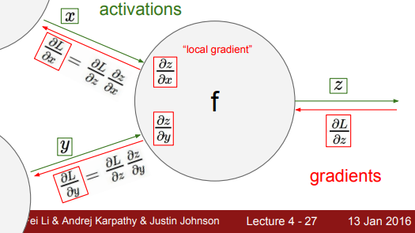
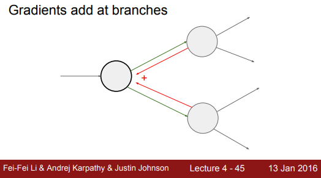
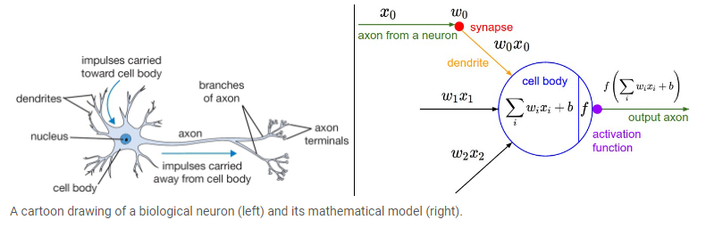
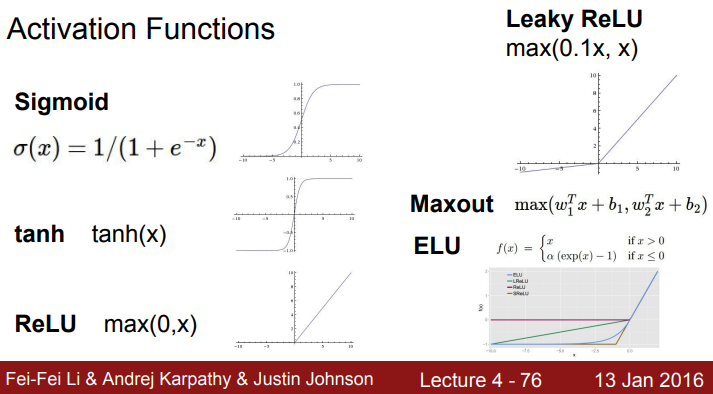

# Lecture 4: Backpropagation, Neural Networks 1
These notes are based primarily on the YouTube video [CS231n Winter 2016: Lecture 4: Backpropagation, Neural Networks 1][youtube]. I also  supplemented this information using the official course notes on [backpropagation][cs231n-l2-1] and [neural networks][cs231n-l2-2]. I am also using [slides from the 2016 lecture 4 presentation][slides].

## Gradients in Backpropagation
- Backpropagation is a recursive application of the *chain rule* along a computational graph to compute the gradient of all inputs/parameters/intermediates.
- Every gate in a network receives some activation (say $x$ and $y$) and produces some output $z$.
- During the forward pass, the local gradients $\partial z/\partial x$ and $\partial z/\partial y$ can be computed and cached.
- During backprop, the gate will learn $\partial L/\partial z$.
- To obtain $\partial L/\partial x$, say, the chain ule is used:

$$\frac{\partial L}{\partial x} = \frac{\partial z}{\partial x} \frac{\partial L}{\partial z}$$



- In practice we usually only compute the gradient for the parameters $W$ and $b$ so that we can use it to perform a parameter update (and not for the training data $x_i$).
- Note: if $f(x,y) = \text{max}(x,y)$, then $\partial f/\partial x = 1$ if $x \ge y$ and $\partial f/\partial y = 1$ if $y \ge x$ (zero otherwise for each case).
- There we two simple examples but not necessary to include here.
- If the output of a gate branches out into a circuit, the gradients add (*multivariate chain rule*).



- Here is a simple example of a multiply gate:

```python
class MultiplyGate:
    def forward(x, y):
        z = x * y
        self.x = x # cache
        self.y = y # cache
        return z

    def backward(dz):
        dx = self.y * dz # [dz/dx * dL/dz]
        dy = self.x * dz # [dz/dy * dL/dz]
        return [dx, dy]
```

- The activations and outputs will be vectors. The local gradients can be thought of as *Jacobian matrices* with elements on the diagonal.
- The parameters $W$ are learned with stochastic gradient descent, and their gradients are derived with chain rule (and computed with backpropagation).

## Neural Networks
- The inclusion of nonlinearities is critical: if there were none, the network would reduce to a simple linear classifier.
- Modeling one neuron can be *very* loosely compared to a biological neuron (but not really):



- Here is an example implementation of one neuron:

```python
class Neuron(object):
  # ... 
  def forward(self, inputs):
    """ assume inputs and weights are 1-D numpy arrays and bias is a number """
    cell_body_sum = np.sum(inputs * self.weights) + self.bias
    firing_rate = 1.0 / (1.0 + math.exp(-cell_body_sum)) # sigmoid activation function
    return firing_rate
```

- Here are some examples of some other activation functions:
    - *Sigmoid*: $\sigma (x) = \frac{1}{1 + e^{-x}}$
    - *tanh*: $\tanh(x)$
    - *ReLU*: $\text{max}(0, x)$
    - *Leaky ReLU*: $\text{max}(0.1x, x)$
    - *Maxout*: $\text{max}(w_1^Tx + b_1, w_2^Tx + b_2)$



- Only the layers with weights are called *hidden layers*:


- Using layers allows uis to use vector operations.
- More neurons is always better (assuming you have the computational power), but regularization needs to be done correctly or else it will over-fit the training data.
- See JavaScript demo of a 2-layer NN [here](https://cs.stanford.edu/people/karpathy/convnetjs/demo/classify2d.html).

[youtube]:https://youtu.be/i94OvYb6noo?si=JITp3WDXwvp2xmEv
[cs231n-l2-1]:https://cs231n.github.io/optimization-2/
[cs231n-l2-2]: https://cs231n.github.io/neural-networks-1/
[slides]:http://cs231n.stanford.edu/slides/2016/winter1516_lecture4.pdf