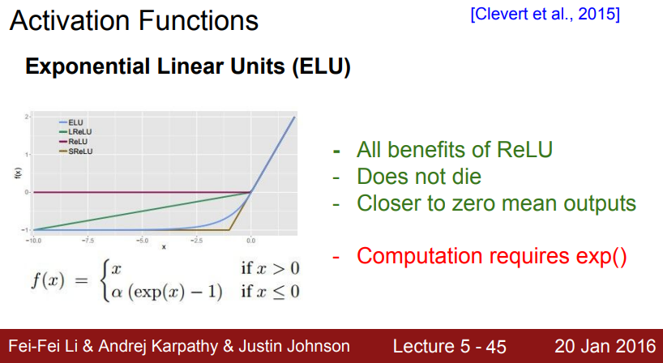

# Lecture 5: Neural Networks Part 2
These notes are based primarily on the YouTube video [CS231n Winter 2016: Lecture 5: Neural Networks Part 2][youtube]. I also  supplemented this information using the official course notes on [neural networks][cs231n-l2-1] and some [data preprocessing and weight initialization stuff][cs231n-l2-2]. I am also using [slides from the 2016 lecture 5 presentation][slides].

## Activation Functions

<p align="center">
    
</p>

### Sigmoid $\sigma$
- The Sigmoid non-linearity has been popular.

$$\sigma (x) = \frac{1}{1 + e^{-x}}$$

- The Sigmoid can cause **three problems**:
- **problem 1**: The gradient will be "killed" by saturated neurons when the local gradient is multiplied by the output gradient when the chain rule is applied during backprop. This can cause *vanishing gradients*. When this happens, the weights below this neuron will not be updated.

<p align="center">
    
</p>

- **problem 2**: The Sigmoid outputs are not zero-centered. This can lead to *slower convergence* due to the zig-zagging dynamics of the gradient updates. This is because the gradient on $W$ is either all positive or all negative. See also [here][sof] for another explanation.

$$f = \sum w_ix_i + b$$
$$\frac{\partial f}{\partial w_i} = x_i$$
$$\frac{\partial L}{\partial w_i} = \frac{\partial L}{\partial f} \frac{\partial f}{\partial w_i} = \frac{\partial L}{\partial f} x_i$$

$$\text{thus, } \frac{\partial L}{\partial w_i} \text{ will always have the same sign as } \frac{\partial L}{\partial f} \text{ since } x_i > 0.$$

<p align="center">
    
</p>

- We can solve problem 2 by normalizing the data in advance to be zero-centered as in batch/layer normalization.
- **problem 3**: the exponential is a bit expensive to compute.

### tanh
- $\tanh(x)$ is another option: It is zero-centered, but it still kills gradients when saturated.
- In practice the tanh non-linearity is always preferred to the sigmoid nonlinearity.

<p align="center">
    
</p>

### The Rectified Linear Unit (*ReLU*)
- ReLU is the much better option because it was found to greatly accelerate the convergence of stochastic gradient descent and is much simpler than using exponential functions.
- The ReLU activation function also has **three problems**:

$$f(x) = \max (0, x)$$

- **problem 1**: The ReLU function is not zero-centered

<p align="center">
    
</p>

- **problem 2**: The local gradient of the ReLU activation neuron can be zero when the input is negative resulting in the same problem of "killing" the gradient during backprop.

<p align="center">
    
</p>

- **problem 3**: You can get unlucky with the initialization of weights or by using too high of a learning rate (causing the weights to update in such a way) that results in the neuron becoming inactive and "dead" throughout training.
- You can initialize the bias to a small positive number (rather than zero) to try and mitigate this problem (might help, might not).

<p align="center">
    
</p>

### Leaky ReLU
- One potential solution for preventing the deactivation of ReLU neurons is to use a *leaky ReLU* function.

<p align="center">
    
</p>

### Exponential Linear Units (ELU)
- The *ELU* provides benefits similar to ReLU but requires computation of the exponential (may or may not be helpful).

<p align="center">
    
</p>

### Maxout Neuron
- The *maxout neuron* uses a separate set of weights then computes the $\max$.
- It aims to generalize the ReLU and leaky ReLU.
- It stays in the linear regime: does not saturate and does not die.

$$f(x) = \max (W_1^T \mathbf{x}, W_2^T \mathbf{x})$$

- The biggest problem is the number of parameters requires is doubled.

### Summary of Activation Functions
- Use the ReLU non-linearity, but be careful with the learning rates and possibly monitor the fraction of “dead” units in a network.
- If this is a concern, give Leaky ReLU or Maxout a try.
- Never use sigmoid.
- Try tanh, but expect it to work worse than ReLU/Maxout.

## Data Preprocessing
- Preprocessing statistics (like the mean) is computed on training data then applied to training, validation, and test data.
- To *zero-center* data:

```python
x -= np.mean(X, axis=0)
```

- To *normalize* data (not common with images):

```python
x /= np.std(X, axis=0)
```

<p align="center">
    
</p>

- For images: center only. You subtract the *average pixel value* over the whole training set.

## Weight Initialization

### Zero initialization
- If $W = 0$, the neurons will all look the same after training.

### Small Random Numbers
- Better to use small random values (zero mean, unit standard deviation gaussian).

```python
W = 0.01 * np.random.randn(D, H)
```

- *note*: smaller weights is not always better because the neuron will have small gradient diminishing the "gradient signal" during backprop.
-  OK for small networks but can lead to non-homogeneous distributions of activations across the layers of a network.
- The *problem* is that the distribution of the outputs from a randomly initialized neuron has a *variance that grows with the number of inputs*.

<p align="center">
    
</p>

### Calibrating the variances with $\frac{1}{\sqrt n}$
- We can address the problem mentioned above by normalizing the output of each neuron by scaling its weight by the square-root of its number of inputs.
- This ensures that all neurons in the network initially have approximately the same output distribution and empirically improves the rate of convergence.
- Results in more sensible distribution of neuron activation throughout the network.

```python
W = np.random.randn(n) / sqrt(n)
```

- Works with $\tanh$ but not ReLU neurons because it *reduces the variance by a factor of 2* (*He et al., 2015*).
- He initialization takes this factor of two into account.
- This is what is current uses in practice.

```python
W = np.random.randn(n) * sqrt(2.0 / n)
```

<p align="center">
    
</p>

### Batch Normalization
- Explicitly forces the activations throughout a network to take on a unit gaussian distribution at the beginning of the training.
- Amounts to insert the BatchNorm layer immediately after fully connected layers (or convolutional layers) and before the nonlinearity.
- Takes $x^{(k)}$ and turns it into a unit gaussian.

$$\hat{x}^{(k)} = \frac{x^{(k)} - E[x^{(k)}]}{\sqrt{Var[x^{(k)}]}}$$

- Note: $\tanh$ doesn't necessarily want it's input to be a unit gaussian, so you can let the network learn $\gamma = \sqrt{Var[x^{(k)}]}$ and $\beta = E[x^{(k)}]$ to undo this mapping. Thus, $y^{(k)}$ would be the input to $\tanh$.

$$y^{(k)} = \gamma ^{(k)} \hat{x}^{(k)} + \beta ^{(k)}$$

- So the batch normalization algorithm is as follows:
    1. compute the mini-batch mean: $\mu = \frac{1}{m} \sum_{i=1}^m x_i$
    2. compute the mini-batch variance: $\sigma ^2 = \frac{1}{m} \sum_{i=1}^m (x_i = \mu)^2$
    3. normalize: $\hat{x}^{(k)} = \frac{x^{(k)} - \mu}{\sqrt{\sigma ^2 + \epsilon}}$
    4. scale and shift: $y^{(k)} = \gamma ^{(k)} \hat{x}^{(k)} + \beta ^{(k)}$

- note: at test time, mean/std are not computed on the batch (use a fixed empirical mean computed during training).
- Benefits of batch normalization:
    - improves gradient flow through network
    - allows higher learning rates
    - reduces dependence on initialization
    - acts as a form of regularization and slightly reduces the need for dropout (maybe)

## Babysitting the Learning Process
- Run one forward pass and make sure loss is loss $L \sim -\log{1 / N}$, the $N$ is the number of classes (shows there is a diffuse distribution).
- Add regularization and expect loss to go up a bit (there is an additional term in the objective).
- Over-fit a small piece of the training data ($L \rightarrow 0$).
- Add small regularization and find a learning rate that makes the loss go down.
- When you increase learning rate and things blow up, it's too high.

## Hyperparameter Optimization
- Use coarse then fine approach:
    - First stage: only a few epochs to get rough idea of what params work.
    - Second stage: longer running time, finer search.
    - Repeat as necessary.
- Tip: if $L_i > 3 * L_1$, then stop early.
- Use random searching for hyperparamer values because you'll be sure to not waste time on unimportant parameters:

<p align="center">
    
</p>

- Hyperparameters to play with:
    - Network architecture
    - learning rate, its decay schedule, update type
    - regularization (L2/dropout strength)
- Monitor and visualize loss curve

<p align="center">
    
</p>

- Monitor the accuracy (can reveal variance)

<p align="center">
    
</p>

- Track the ratio of weight updates / weight magnitudes (want to be around 0.001).
- You don't want the updates to be large compared to the weights.

[youtube]:https://youtu.be/gYpoJMlgyXA?si=tZqQd6oqfmjcBIV0
[cs231n-l2-1]:https://cs231n.github.io/neural-networks-1/
[cs231n-l2-2]:https://cs231n.github.io/neural-networks-2/
[slides]:http://cs231n.stanford.edu/slides/2016/winter1516_lecture5.pdf
[sof]:https://stats.stackexchange.com/questions/237169/why-are-non-zero-centered-activation-functions-a-problem-in-backpropagation