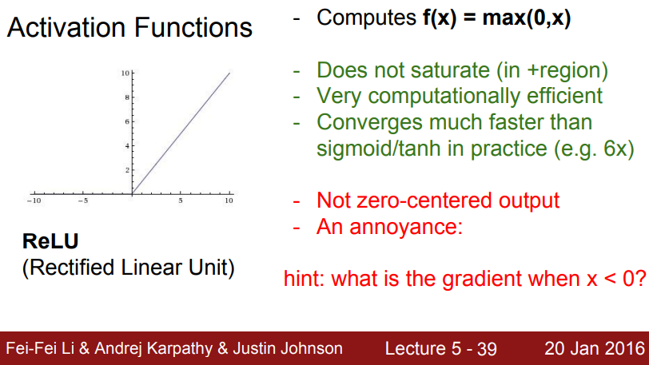

# Lecture 5: Neural Networks Part 2
These notes are based primarily on the YouTube video [CS231n Winter 2016: Lecture 5: Neural Networks Part 2][youtube]. I also  supplemented this information using the official course notes on [neural networks][cs231n-l2-1]. I am also using [slides from the 2016 lecture 5 presentation][slides].

## Activation Functions

    

- The Sigmoid non-linearity has been popular.

$$\sigma (x) = \frac{1}{1 + e^{-x}}$$

- The Sigmoid can cause **three problems**:
- **problem 1**: The gradient will be "killed" by saturated neurons when the local gradient is multiplied by the output gradient when the chain rule is applied during backprop. This can cause *vanishing gradients*.

    

- **problem 2**: The Sigmoid outputs are not zero-centered. This can lead to *slower convergence* due to the zig-zagging dynamics of the gradient updates. This is because the gradient on $W$ is either all positive or all negative. See also [here][sof] for another explanation.

$$f = \sum w_ix_i + b$$
$$\frac{\partial f}{\partial w_i} = x_i$$
$$\frac{\partial L}{\partial w_i} = \frac{\partial L}{\partial f} \frac{\partial f}{\partial w_i} = \frac{\partial L}{\partial f} x_i$$

$$\text{thus, } \frac{\partial L}{\partial w_i} \text{ will always have the same sign as } \frac{\partial L}{\partial f} \text{ since } x_i > 0.$$

    

- We can solve problem 2 by normalizing the data in advance to be zero-centered as in batch/layer normalization.
- **problem 3**: the exponential is a bit expensive to compute.

- $\tanh(x)$ is another option: It is zero-centered, but it still kills gradients when saturated.
- In practice the tanh non-linearity is always preferred to the sigmoid nonlinearity.

    

- The Rectified Linear Unit (*ReLU*) is the much better option that resolves most of these problems, but it has some of it's own.

$$f(x) = \max (0, x)$$

    

**INCOMPLETE... TO BE CONTINUED**

[youtube]:https://youtu.be/gYpoJMlgyXA?si=tZqQd6oqfmjcBIV0
[cs231n-l2-1]:https://cs231n.github.io/neural-networks-1/
[slides]:http://cs231n.stanford.edu/slides/2016/winter1516_lecture5.pdf
[sof]:https://stats.stackexchange.com/questions/237169/why-are-non-zero-centered-activation-functions-a-problem-in-backpropagation