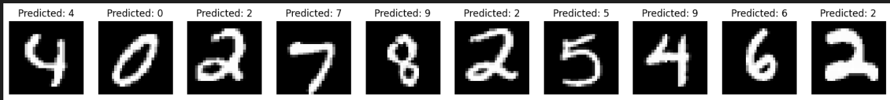

# Digit Recognizer

This is for Kaggle's [Digit Recognizer competition](https://www.kaggle.com/competitions/digit-recognizer)

This approach is based off of Andrew Ng's Neural Networks and Deep Learning course in the [Deep Learning specialization on Coursera](https://www.coursera.org/specializations/deep-learning); however, it has been adapted for this particular problem.

This approach includes a implementation of a deep neural network utilizing numpy.

With the model presented here, I achieved ~81% accuracy on both the training and test data sets (see snippet of predictions below from test set).

# Competition Description

MNIST ("Modified National Institute of Standards and Technology") is the de facto “hello world” dataset of computer vision. Since its release in 1999, this classic dataset of handwritten images has served as the basis for benchmarking classification algorithms. As new machine learning techniques emerge, MNIST remains a reliable resource for researchers and learners alike.

In this competition, your goal is to correctly identify digits from a dataset of tens of thousands of handwritten images. We’ve curated a set of tutorial-style kernels which cover everything from regression to neural networks. We encourage you to experiment with different algorithms to learn first-hand what works well and how techniques compare.
